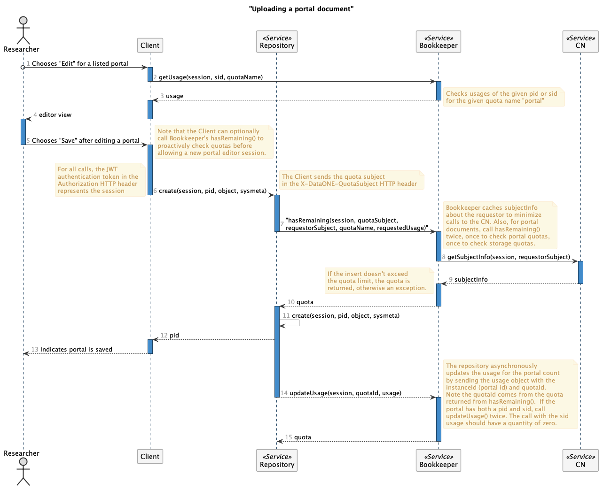

DataONE Bookkeeper Service
==========================

Bookkeeper is a RESTful service that is part of the DataONE_ Coordinating Node
infrastructure. It is used to manage products, customers, orders, subscriptions,
and quotas related to the DataONE Plus and Hosted Repositories services.  See the ``docs`` for more details.

.. _DataONE: https://dataone.org/

Installation
------------

#. Download Bookkeeper and expand the archive

.. code:: bash

    $ curl -LO "https://github.com/DataONEorg/bookkeeper/archive/master.zip" && \
      unzip master.zip
      
#. Install PostgreSQL 9+. See the homebrew installation instructions.

.. code:: bash

    $ brew install postgresql
    # Configure PostgreSQL appropriately to connect (pg_hba.conf, etc.)

#. Create a database and user

.. code:: bash

    $ sudo su - postgres -c "createdb -O bookkeeper bookkeeper"
    $ sudo su - postgres -c "createuser bookkeeper -P"

#. Install FlywayDB_

.. _FlywayDB: https://flywaydb.org

Flyway is used to manage the SQL database schema.

    **Note**: Adjust the values in ``db/flyway.conf`` to your database and password

.. code:: bash

    $ flyway migrate -configFiles=bookkeeper-master/src/main/resources/db 

The database schema should be created, and you're ready to start the application.

#. Compile and start bookkeeper

.. code:: bash

    $ cd  bookkeeper-master && mvn package
    $ java -jar target/bookkeeper-1.0-SNAPSHOT.jar server bookkeeper.yml
    
Getting Started
---------------

The following example uses ``bash`` and ``curl`` to demonstrate client connections.

Interacting with the service requires authentication for most REST method
calls using a JSON Web Token.  Log in at https://search.daataone.org to get
a token (in ``My Profile > Settings > Authentication Token``).  All messages are transferred as JSON.

#. Set your token

.. code::
    
    $ token="<paste-your-token-here>"

#. Get a list of ``Products`` that can be ordered. The ``/products`` endpoint is one that doesn't require authentication so pricing pages can be built.

.. code::
    
    $ curl -H "Accept: application/json" "http://localhost:8080/bookkeeper/v1/products"

This returns a ``ProductList``:

.. code-block:: json
    
    {
        "products": [
            {
                "id": 1,
                "object": "product",
                "active": true,
                "amount": 32000,
                "caption": "Faculty or research lab",
                "currency": "USD",
                "created": 1579898043,
                "description": "Create a customized portal for your work and projects.   Help others understand and access your data.",
                "interval": "year",
                "name": "Individual",
                "statementDescriptor": "DataONE Subscription Plan - Individual",
                "type": "service",
                "unitLabel": "subscription",
                "url": "https://products.dataone.org/plus",
                "metadata": {
                    "features": [
                        {
                            "name": "branded_portal",
                            "label": "Branded Portals",
                            "description": "Showcase your research, data, results, and usage metrics by building a custom web portal.",
                            "quota": {
                                "object": "quota",
                                "name": "portal",
                                "softLimit": "1",
                                "hardLimit": "1",
                                "unit": "portal"
                            }
                        },
                        {
                            "name": "custom_search_filters",
                            "label": "Custom Search Filters",
                            "description": "Create custom search filters in your portal to allow   scientists to search your holdings using filters appropriate to your field of science."
                        },
                        {
                            "name": "fair_data_assessment",
                            "label": "FAIR Data Assessments",
                            "description": "Access quality metric reports using the FAIR data suite of checks."
                        },
                        {
                            "name": "custom_quality_service",
                            "label": "Custom Quality Metrics",
                            "description": "Create a suite of custom quality metadata checks specific to your datasets."
                        },
                        {
                            "name": "aggregated_metrics",
                            "label": "Aggregated Metrics",
                            "description": "Access and share reports on aggregated usage metrics such as dataset views, data downloads, and dataset citations."
                        },
                        {
                            "name": "dataone_voting_member",
                            "label": "DataONE Voting Member",
                            "description": "Vote on the direction and priorities at DataONE Community meetings."
                        }
                    ]
                }
            },
            ...
        ]
    }
    
#. Create a ``Customer`` with the given name, surname, and ORCID of the logged in user (saved as ``customer.json``):

.. code-block:: json
  
    {
        "object": "customer",
        "givenName": "Christopher",
        "surName": "Jones",
        "email": "cjones@nceas.ucsb.edu",
        "subject": "http://orcid.org/0000-0002-8121-2343"
    }

Then ``POST`` it to the ``/customers`` endpoint:

.. code-block:: bash

    curl -X POST \
        -H "Authorization: Bearer ${token}" \
        -H "Content-Type: application/json" \
        -H "Accept: application/json" \
        -d "@customer.json" \
        "http://localhost:8080/bookkeeper/v1/customers"

The customer object is returned with an ``id`` attribute which is used to  create an ``Order``.

.. code-block:: json
  
    {
        "id": 1,
        "object": "customer",
        "givenName": "Christopher",
        "surName": "Jones",
        "email": "cjones@nceas.ucsb.edu",
        "subject": "http://orcid.org/0000-0002-8121-2343"
    }

#. Create an ``Order`` (``order.json``), and update it as many times as needed. ``POST`` the order to the ``/orders`` endpoint, and ``PUT`` it to ``/orders/:id`` for updates.

.. code:: json

    {
        "object": "order",
        "customer": 1,
        "status": "created",
        "amount": 32000,
        "items": [{
            "object": "order_item",
            "type": "sku",
            "parent": 1, 
            "quantity": 1
            }]
    }
    
Then ``POST`` it to the ``/orders`` endpoint:

.. code-block:: bash

    curl -X POST \
        -H "Authorization: Bearer ${token}" \
        -H "Content-Type: application/json" \
        -H "Accept: application/json" \
        -d "@order.json" \
        "http://localhost:8080/bookkeeper/v1/orders"

This returns:

.. code:: json

    {
        "id": 1,
        "object": "order",
        "amount": 32000,
        "amountReturned": 0,
        "charge": {},
        "created": 1579986378,
        "customer": 1,
        "items": [
            {
                "object": "order_item",
                "amount": 32000,
                "currency": "USD",
                "description": "DataONE Subscription Plan - Individual",
                "parent": 1,
                "quantity": 1,
                "type": "sku"
            }
        ],
        "metadata": {},
        "status": "created",
        "statusTransitions": {},
        "updated": 0,
        "totalAmount": 32000
    }
    
#. Confirm the ``Order``.  Confirming currently sets a **trial period** rather than paying for the order.  Payments will be added into this workflow later.

.. code-block:: bash

    curl -X POST \
        -H "Authorization: Bearer ${token}" \
        -H "Content-Type: application/json" \
        -H "Accept: application/json" \
        "http://localhost:8080/bookkeeper/v1/orders/1/pay"

#. You have confirmed the order, and it is in the ``paid`` state.  This returns:

.. code:: json

    {
        "id": 1,
        "object": "order",
        "amount": 32000,
        "amountReturned": 0,
        "charge": {},
        "created": 1579986378,
        "customer": 1,
        "items": [{
            "object": "order_item",
            "amount": 32000,
            "currency": "USD",
            "description": "DataONE Subscription Plan - Individual",
            "parent": 1,
            "quantity": 1,
            "type": "sku"
            }],
            "metadata": {},
            "status": "paid",
            "statusTransitions": {},
            "updated": 1579992719,
            "totalAmount": 32000
        }
    }
    
#. View your quotas.  Once the order is paid, a subscription to the product(s) is created, and your quotas are set.

.. code:: bash

    curl \
        -H "Authorization: Bearer ${token}" \
        -H "Accept: application/json" \
        "http://localhost:8080/bookkeeper/v1/quotas"

This returns a ``QuotaList``:

.. code:: json

    {
        "quotas": [{
            "id": 4,
            "object": "quota",
            "name": "portal",
            "softLimit": 1.0,
            "hardLimit": 1.0,
            "usage": 0.0,
            "unit": "portal",
            "subscriptionId": 1,
            "subject": "http://orcid.org/0000-0002-8121-2341"
        }]
    }

Creating an object
------------------

Once quotas are established through an order and a subsequent subscription, the quotas are
enforced by participating repositories.  The following diagram shows the sequence of calls made
when a portal document is uploaded to a repository.

..
    @startuml ./docs/images/create-portal.png
    !include ./docs/plantuml-styles.txt

    autonumber ""
    title "Uploading a portal document"
    actor Researcher
    participant Client
    participant Repository <<Service>>
    participant Bookkeeper <<Service>>
    participant "CN" <<Service>>

    Researcher o-> Client : Chooses "Save" after editing a portal

    note right
        Note that the Client can optionally
        call Bookkeeper's hasRemaining() to
        proactively check quotas before
        allowing a new portal editor session.
    end note

    activate Client
        Client -> Repository : create(session, pid, object, sysmeta)
    deactivate Client

    activate Repository
        note left
            For all calls, the JWT
            authentication token in the
            Authorization HTTP header
            represents the session
        end note
        note right
            The Client sends the quota subject
            in the X-DataONE-QuotaSubject HTTP header
        end note

        Repository -> Bookkeeper : "hasRemaining(session, quotaSubject, \nrequestorSubject, quotaName, requestedUsage)"
    deactivate Repository

    activate Bookkeeper
        note right
            Bookkeeper caches subjectInfo
            about the requestor to minimize
            calls to the CN. Also, for portal
            documents, call hasRemaining()
            twice, once to check portal quotas,
            once to check storage quotas.
        end note
        Bookkeeper -> CN : getSubjectInfo(session, requestorSubject)
    deactivate Bookkeeper

    activate CN
        CN --> Bookkeeper: subjectInfo
    deactivate CN

    activate Bookkeeper
        note left
            If the insert doesn't exceed 
            the quota limit, the quota is
            returned, otherwise an exception.
        end note
        Bookkeeper --> Repository : quota
    deactivate Bookkeeper

    activate Repository
        Repository -> Repository : create(session, pid, object, sysmeta)
        Repository --> Client : pid
        activate Client
            Client --> Researcher : Indicates portal is saved
        deactivate Client
        Repository --> Bookkeeper : updateUsage(session, quotaId, usage)
    deactivate Repository
    
    activate Bookkeeper
        note right
            The repository asynchronously 
            updates the usage for the portal count
            by sending the usage object with the
            instanceId (portal id) and quotaId. 
            Note the quotaId comes from the quota 
            returned from hasRemaining().  If the
            portal has both a pid and sid, call
            updateUsage() twice. The call with the sid 
            usage should have a quantity of zero.
        end note
        Bookkeeper --> Repository : quota
    deactivate Bookkeeper
    
    @enduml

