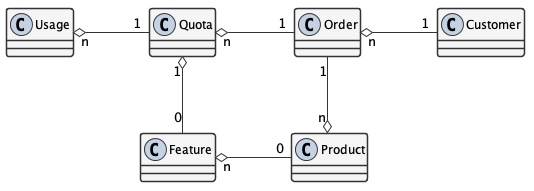

.. contents:: Table of Contents
    :depth: 2

Overview
--------

To sustain ongoing operations, DataONE offers paid services for memberships alongside free services. This document outlines the design and implementation details needed to offer and manage these services. It describes the ``Products``, ``Customers``, ``Services``, ``Quotas``, ``Usages``, and ``Orders`` that DataONE needs to track. This documents:

- What service ``Products`` are available for purchase
- What ``Products`` a ``Customer``_ purchased in an ``Order``
- What ``Quota`` limits are set for ``Customers`` per paid ``Order``.
- What ``Usages`` are associated with a given ``Quota``

The following diagram shows the membership and payment records stored by DataONE and their relationships.

..
    @startuml images/overview.png
    !include ./plantuml-styles.txt
    class Product {
    }
    class Feature {
    }
    class Customer {
    }
    class Order {
    }
    class Quota {
    }
    class Usage {
    }
    

    Customer "1" -right-o "n" Order : "          "
    Order "1" -up-o "n" Product : "          "
    Order "1" -right-o "n" Quota : "          "
    Quota "1" -right-o "n" Usage : "          "
    Product "0" -right-o "n" Feature : "          "
    Feature "0" -down-o "1" Quota : "          "
    @enduml
    
